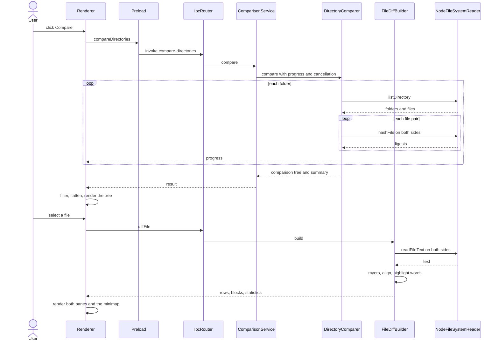

# Open Compare

A WinMerge-style directory and file comparison tool for macOS, built with TypeScript, Electron and
React. Point it at two folders, and it shows you a merged tree of everything that is identical,
different, or present on only one side — then a synchronised side-by-side diff of any file you pick,
with word-level highlighting of what actually changed.

**Open Compare never writes to your files.** It opens everything read-only; there is no copy, merge or
delete. Comparing a production folder against a backup cannot damage either one.


## Features

**Folder comparison**

- Recursive merge of two trees into one list, each entry tagged identical / different / left only /
  right only, with folder status rolled up from its contents.
- Every differing file carries its line change count, `+added −removed`, counted the way
  `git diff --numstat` counts — so a rewritten line shows as one of each. A file present on one side
  only reads as all additions or all removals. Sizes and timestamps move to the row's tooltip.
- Three comparison modes: full **file contents** (SHA-1 over both files), **size and date**, or
  **size only**.
- Exclude and include filters using shell-style patterns (`node_modules`, `*.log`, `*.ts`), plus a
  hidden-file toggle and a non-recursive mode.
- Live progress while scanning, and a Stop button — starting a new comparison cancels the one in
  flight.
- Status filter chips and a name search that hide whole categories or narrow the list as you type.

**File comparison**

- Side-by-side panes with synchronised vertical scrolling and independent horizontal scrolling.
- Myers diff over lines, then word-level diff inside each changed pair, so you see the two characters
  that moved rather than two highlighted lines.
- Ignore options: trailing or all whitespace, letter case, and blank lines. Ignored lines still
  appear in the panes so the line numbers match the file on disk.
- Jump between differences (F7 / Shift-F7), a minimap of every change in the file, and a marker on
  the difference you are currently on.
- Binary files are detected and reported rather than rendered as noise; files present on one side
  only are shown as an all-removed or all-added diff.
- Line-ending detection (LF / CRLF / CR / mixed) per side.

**Interface**

- Native macOS window with an inset title bar, and light and dark palettes that follow the system
  appearance.
- Both the folder tree and the diff panes are virtualised — a 4,000-line diff renders 25 rows and
  scrolls at full speed.
- Folders, options and filters are remembered between launches.


## Getting started

Requirements: macOS, Node 20.19+ or 22.12+ (Vite's floor; developed on Node 24), and Yarn Classic 1.x.
Everything else, including the Electron runtime itself, comes down with the install.

```bash
yarn install          # downloads the Electron runtime as part of the install
yarn dev              # run the app with hot reload
```

Scripts:

| command | what it does |
| --- | --- |
| `yarn dev` | run the app in development with renderer hot reload |
| `yarn build` | type-check both projects, then bundle main, preload and renderer into `out/` |
| `yarn start` | run the production bundle from `out/` |
| `yarn dist` | build and package macOS `.dmg` installers into `release/` |
| `yarn typecheck` | type-check only |
| `yarn validate` | run the comparison engine headlessly and assert its results |

## Building for macOS

`yarn build` is the compile step. It type-checks `tsconfig.node.json` and `tsconfig.web.json`
separately — the main and preload processes against Node types, the renderer against DOM types — and
only then runs `electron-vite build`, so a type error stops the build rather than shipping into the
bundle. The output is three entry points under `out/`:

```
out/
├── main/main.js           the main process
├── preload/preload.js     the contextBridge surface
└── renderer/              index.html plus the hashed JS and CSS assets
```

`yarn start` runs that bundle through `electron-vite preview`, which is the quickest way to confirm a
production build behaves like `yarn dev` did before you spend time packaging it.

### Packaging a `.dmg`

```bash
yarn dist
```

That is `yarn build` followed by `electron-builder --mac`, driven by `electron-builder.yml`. It
produces **both architectures** — a full Electron runtime is copied into each, so expect roughly
260 MB of output and about a minute on Apple silicon:

| file | for |
| --- | --- |
| `release/Open Compare-<version>-arm64.dmg` | Apple silicon |
| `release/Open Compare-<version>.dmg` | Intel |

The unpacked bundles are left beside them at `release/mac-arm64/Open Compare.app` and
`release/mac/Open Compare.app`, which is what you want when you are testing a build rather than
distributing it — drag one straight to `/Applications`, or just double-click it where it sits. The
`.blockmap` files next to each `.dmg` are for differential updates; nothing reads them unless you add
an updater.

The first run of a build downloads the Electron zip for whichever architecture you are not on, so
allow extra time and a network connection for it. Subsequent builds reuse the cache in
`~/Library/Caches/electron`.

To skip the architecture you do not need, call `electron-builder` directly — the `--arm64` and `--x64`
flags override the target list in the config:

```bash
yarn build && npx electron-builder --mac --arm64    # Apple silicon only, roughly half the time
yarn build && npx electron-builder --mac --x64      # Intel only
```

Bump `version` in `package.json` before packaging a release — it is what names the `.dmg` and what
shows in **Open Compare › About**.

### Signing and notarisation

`yarn dist` produces an **unsigned** app. `hardenedRuntime` is on in `electron-builder.yml`, but with
no Developer ID identity in your keychain electron-builder logs
`skipped macOS application code signing` and packages the app as it is. That is fine on the machine
that built it and fine for a colleague you hand the `.dmg` to directly.

It is not fine for distribution. A `.dmg` that arrives over the internet carries a quarantine flag,
and Gatekeeper refuses to open an unsigned app that has one — the recipient sees "Open Compare is
damaged and can't be opened", which is Gatekeeper's misleading wording for "unsigned", not a corrupt
download. They can get past it with **right-click › Open** (or `xattr -dr com.apple.quarantine
"/Applications/Open Compare.app"`), but the real fix is to sign and notarise:

1. Get a **Developer ID Application** certificate from an Apple Developer Program account and install
   it in your login keychain. `security find-identity -v -p codesigning` should list it —
   electron-builder picks it up automatically once it is there.
2. Add an app-specific password for notarisation and export the credentials before building:

   ```bash
   export APPLE_ID="you@example.com"
   export APPLE_APP_SPECIFIC_PASSWORD="xxxx-xxxx-xxxx-xxxx"
   export APPLE_TEAM_ID="XXXXXXXXXX"
   ```

3. Turn on notarisation in `electron-builder.yml`:

   ```yaml
   mac:
     notarize:
       teamId: XXXXXXXXXX
   ```

Then `yarn dist` signs, uploads to Apple, waits for the ticket and staples it. Notarisation adds
several minutes per architecture. Verify the result with
`spctl -a -vvv "release/mac-arm64/Open Compare.app"`, which should report
`accepted / source=Notarized Developer ID`.

### Application icon

The icon is drawn as vector art and rasterised into the `.icns` the bundle needs:

```
build/
├── icon.svg          the artwork, 1024×1024
├── icon-small.svg    a simplified cut for the 16 / 32 / 64px slices
├── make-icon.sh      rasterises both into icon.icns and icon.png
├── icon.icns         what electron-builder packages
└── icon.png          the dock icon under `yarn dev`
```

`icon.icns` and `icon.png` are committed, so building the app needs nothing extra. Re-run
`./build/make-icon.sh` after editing either SVG — it needs `rsvg-convert`
(`brew install librsvg`); `iconutil` ships with macOS.

Two SVGs rather than one because an icon has to survive being drawn at 16px in a Finder list. The
full artwork's five rows per pane turn to grey mush at that size, so the script renders every slice
of 64px and below from `icon-small.svg`, which says the same thing with three heavier rows.

A packaged app takes its dock icon from the bundle, but `yarn dev` runs under the stock Electron
binary and would otherwise show the Electron logo. `DockIcon` applies `icon.png` at startup when
`app.isPackaged` is false, which is the only reason that PNG exists.

### Troubleshooting

- **The app will not launch after `yarn install`.** The Electron binary download was skipped — run
  `node node_modules/electron/install.js` to fetch it.
- **`yarn dist` fails with `Unable to detach device cleanly … Resource busy`.** macOS held the disk
  image open while it was being finalised, usually Spotlight or an endpoint agent. The `.app` bundle
  in `release/mac-<arch>/` is already complete at that point; re-running the command produces the
  `.dmg`.
- **The build fails on a type error but the app runs under `yarn dev`.** `yarn dev` does not
  type-check. Run `yarn typecheck` to see both projects' errors on their own.
- **A stale bundle keeps coming back.** Delete `out/`, `release/` and the `*.tsbuildinfo` files;
  incremental type-check state survives an otherwise clean rebuild.

## Menu and keyboard

| shortcut | action |
| --- | --- |
| ⌘1 / ⌘2 | choose the left / right folder |
| ⌘↩ | run the comparison |
| F7 / ⇧F7 | next / previous difference |
| ⌘I | show or hide identical files |
| ↑ ↓ | move through the tree |
| → ← | expand / collapse a folder |

## How a comparison is decided

A file pair is **identical** when the chosen mode says so:

| mode | rule |
| --- | --- |
| File contents | sizes match **and** SHA-1 digests match |
| Size and date | sizes match **and** modification times are within 2 seconds |
| Size only | sizes match |

Sizes are always checked first, so a size mismatch short-circuits before any file is read. A folder is
identical when every entry inside it is identical; otherwise it is different, or left/right only when
it exists on one side alone. Files that cannot be read are reported as different and counted in the
status bar rather than failing the whole scan.

**Line change counts.** Only files that actually differ are diffed for their `+added −removed` count;
identical files are skipped, so the cost scales with the number of differences rather than the size of
the tree. Lines are compared exactly there — the ignore-whitespace and ignore-case options belong to
the file you are looking at, not to a folder-wide scan, so the tree always reports the raw change.
The count reads `—` when it would be meaningless (binary content, past the size ceiling, unreadable)
and `0` for files that differ in bytes but not in any line, which is what a pure line-ending change
looks like.

## Architecture

The project follows the layering used across these tools — pure logic in `core/`, all I/O at the
edges, and a thin composition root — mapped onto Electron's three processes:

```
src/
├── core/                  Pure comparison logic. No Electron, no fs, no DOM.
│   ├── FileSystemReader.ts        the port every filesystem must satisfy
│   ├── DirectoryComparer.ts       entry point for a folder comparison
│   ├── DirectoryComparisonRun.ts  one traversal, holds that run's state
│   ├── FileContentComparer.ts     decides identical vs different
│   ├── LineChangeCounter.ts       the +added / −removed shown against each row
│   ├── TextFileProbe.ts           the size ceiling and binary test, shared
│   ├── PathFilter.ts              include / exclude / hidden rules
│   ├── ComparisonTreeFilter.ts    the view filter, shared with the renderer
│   ├── FileDiffBuilder.ts         entry point for a file diff
│   ├── diff/                      Myers, alignment, inline highlighting
│   └── models/                    the types both processes exchange
├── main/                  Electron main process: the I/O adapters and the window.
│   ├── NodeFileSystemReader.ts    the real filesystem, implements the port
│   ├── ComparisonService.ts       one comparison at a time, cancellable
│   ├── FileDiffService.ts
│   ├── IpcRouter.ts               channel wiring
│   └── main.ts                    composition root
├── preload/               contextBridge surface — the only thing the UI can call.
├── renderer/              React UI: tree, diff panes, minimap, options.
├── shared/ipc.ts          The typed contract both sides compile against.
└── validation/            Headless harness: an in-memory filesystem plus assertions.
```

The dependency arrow always points inward. `core/` declares the `FileSystemReader` port;
`main/NodeFileSystemReader` implements it against the disk and `validation/InMemoryFileSystemReader`
implements it against a `Map`, which is what makes the whole engine testable without Electron.

### Classes


### Runtime flow



## Verifying the engine

`yarn validate` runs the whole comparison engine against an in-memory filesystem and asserts the
results — no window, no disk, no Electron. It covers folder statuses and summaries, all three
comparison modes, the include/exclude/hidden filters, line change counts, diff rows and statistics,
word-level highlighting, the ignore options, binary detection, one-sided files, and diff invariants
over generated inputs (every row set must rebuild both original files exactly, and every equal row
must hold identical text).

```
$ yarn validate
  ✓ Directory comparison › folder rolls up to different
  ✓ Line change counts › one line rewritten plus one appended
  ✓ File diff › word-level highlight on the right
  ✓ Diff invariants › seed 613 rebuilds both sides
  …
57/57 checks passed
```

The command exits non-zero if any check fails, so it drops straight into CI.

## Limits

- Read-only by design: no copy, merge, delete or in-place editing.
- Text comparison is capped at 12 MB per file; larger files report their size instead, and their line
  change count reads `—`.
- Above an edit distance of 2,000 lines the diff falls back to "replace this region" rather than
  spending unbounded memory on the exact edit script.
- Symbolic links are compared as links; they are never followed into their target directory.
- Non-recursive mode lists subfolders without descending into them, so a folder shown as identical
  in that mode only means the folder exists on both sides.
