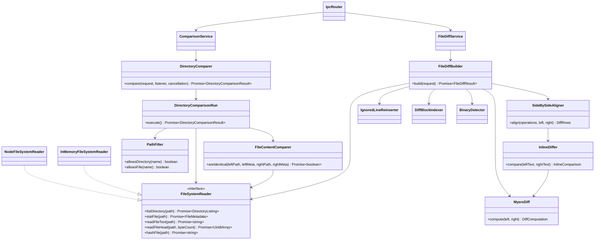
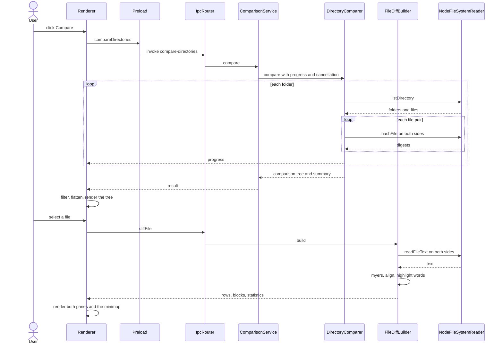

# Architecture

The project follows the layering used across these tools — pure logic in `core/`, all I/O at the
edges, and a thin composition root — mapped onto Electron's three processes:

```
src/
├── core/                  Pure comparison logic. No Electron, no fs, no DOM.
│   ├── FileSystemReader.ts        the port every filesystem must satisfy
│   ├── DirectoryComparer.ts       entry point for a folder comparison
│   ├── DirectoryComparisonRun.ts  one traversal, holds that run's state
│   ├── FileContentComparer.ts     decides identical vs different
│   ├── LineChangeCounter.ts       the +added / −removed shown against each row
│   ├── TextFileProbe.ts           the size ceiling and binary test, shared
│   ├── PathFilter.ts              include / exclude / hidden rules
│   ├── ComparisonTreeFilter.ts    the view filter, shared with the renderer
│   ├── FileDiffBuilder.ts         entry point for a file diff
│   ├── diff/                      Myers, alignment, inline highlighting
│   └── models/                    the types both processes exchange
├── main/                  Electron main process: the I/O adapters and the window.
│   ├── NodeFileSystemReader.ts    the real filesystem, implements the port
│   ├── ComparisonService.ts       one comparison at a time, cancellable
│   ├── FileDiffService.ts
│   ├── IpcRouter.ts               channel wiring
│   └── main.ts                    composition root
├── preload/               contextBridge surface — the only thing the UI can call.
├── renderer/              React UI: tree, diff panes, minimap, options.
├── shared/ipc.ts          The typed contract both sides compile against.
└── validation/            Headless harness: an in-memory filesystem plus assertions.
```

The dependency arrow always points inward. `core/` declares the `FileSystemReader` port;
`main/NodeFileSystemReader` implements it against the disk and `validation/InMemoryFileSystemReader`
implements it against a `Map`, which is what makes the whole engine testable without Electron.

## Classes



## Runtime flow



---

[← back to the readme](../README.md)
